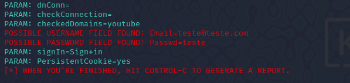

# Atividade Bootcamp Santander CyberSegurança 🎯

Este projeto demonstra como configurar um ataque de phishing para captura de credenciais, utilizando o **Kali Linux** e o **Social Engineering Toolkit (SET)**.  
⚠️ **Este projeto é apenas para fins educacionais.**
---

## 📦 Ferramentas Utilizadas

- **Kali Linux**: Sistema operacional especializado em segurança ofensiva.
- **SET (Social Engineering Toolkit)**: Ferramenta para ataques de engenharia social.

---

## 🛠️ Configurando o Phishing no Kali Linux

- Acesso root: ``` sudo su ```
- Iniciando o setoolkit: ``` setoolkit ```
- Tipo de ataque: ``` Social-Engineering Attacks ```
- Vetor de ataque: ``` Web Site Attack Vectors ```
- Método de ataque: ```Credential Harvester Attack Method ```
- Método de ataque: ``` Site Cloner ```
- Obtendo o endereço da máquina: ``` ifconfig ```

### Resutados



